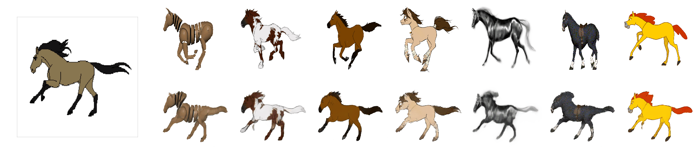

# First Order Motion Model for Image Animation

This repository contains the source code for the paper [First Order Motion Model for Image Animation]() by Aliaksandr Siarohin, [Stéphane Lathuilière](http://stelat.eu), [Sergey Tulyakov](http://stulyakov.com), [Elisa Ricci](http://elisaricci.eu/) and [Nicu Sebe](http://disi.unitn.it/~sebe/). 

## Example animations

The videos on the left show the driving videos. The first row on the right for each dataset shows the source videos. The bottom row contains the animated sequences with motion transferred from the driving video and object taken from the source image. We trained a separate network for each task.

### Fashion Dataset

### MGIF Dataset



### Installation

We support ```python3```. To install the dependencies run:
```
pip install -r requirements.txt
```

### YAML configs

There are several configuration (```config/dataset_name.yaml```) files one for each `dataset`. See ```config/taichi-256.yaml``` to get description of each parameter.


### Pre-trained checkpoint
Checkpoints can be found under following link: [checkpoint](https://yadi.sk/d/lEw8uRm140L_eQ).

### Animation Demo

To run a demo, download checkpoint and run the following command:
```
python demo.py  --config config/dataset_name.yaml --driving_video path/to/driving --source_image path/to/source --checkpoint path/to/checkpoint --relative --adapt_scale
```
The result will be stored in ```result.mp4```.

### Training

To train a model on specific dataset run:
```
CUDA_VISIBLE_DEVICES=0,1,2,3 python run.py config/dataset_name.yaml --device_ids 0,1,2,3
```
The code will create a folder in the log directory (each run will create a time-stamped new directory).
Checkpoints will be saved to this folder.
To check the loss values during training see ```log.txt```.
You can also check training data reconstructions in the ```train-vis``` subfolder.
By default the batch size is tunned to run on 2 or 4 Titan-X gpu (appart from speed it does not make much difference). You can change the batch size in the train_params in corresponding ```.yaml``` file.

### Evaluation on video reconstruction

To evaluate the reconstruction performance run:
```
CUDA_VISIBLE_DEVICES=0 python run.py config/dataset_name.yaml --mode reconstruction --checkpoint path/to/checkpoint
```
You will need to specify the path to the checkpoint,
the ```reconstruction``` subfolder will be created in the checkpoint folder.
The generated video will be stored to this folder, also generated videos will be stored in ```png``` subfolder in loss-less '.png' format for evaluation.
Instructions for computing metrics from the paper can be found: https://github.com/AliaksandrSiarohin/pose-evaluation.

### Image animation

In order to animate videos run:
```
CUDA_VISIBLE_DEVICES=0 python run.py config/dataset_name.yaml --mode animate --checkpoint path/to/checkpoint
```
You will need to specify the path to the checkpoint,
the ```animation``` subfolder will be created in the same folder as the checkpoint.
You can find the generated video there and its loss-less version in the ```png``` subfolder.
By default video from test set will be randomly paired, but you can specify the "source,driving" pairs in the corresponding ```.csv``` files. The path to this file should be specified in corresponding ```.yaml``` file in pairs_list setting.

There are 2 different ways of performing animation:
by using **absolute** keypoint locations or by using **relative** keypoint locations.

1) <i>Animation using absolute coordinates:</i> the animation is performed using the absolute postions of the driving video and appearance of the source image.
In this way there are no specific requirements for the driving video and source appearance that is used.
However this usually leads to poor performance since unrelevant details such as shape is transfered.
Check animate parameters in ```taichi-256.yaml``` to enable this mode.

2) <i>Animation using relative coordinates:</i> from the driving video we first estimate the relative movement of each keypoint,
then we add this movement to the absolute position of keypoints in the source image.
This keypoint along with source image is used for animation. This usually leads to better performance, however this requires
that the object in the first frame of the video and in the source image have the same pose.

### Datasets

1) **Bair**. This dataset can be directly [downloaded](https://yadi.sk/d/66vNK0EwJcVkPg).

2) **Mgif**. This dataset can be directly [downloaded](https://yadi.sk/d/5VdqLARizmnj3Q).

3) **Fashion**. Follow the instruction on dataset downloading [from](https://vision.cs.ubc.ca/datasets/fashion/).

4) **Taichi**. To appear soon.


### Training on your own dataset
1) Resize all the videos to the same size e.g 256x256, the videos can be in '.gif' or '.mp4' format.
But we recommend for each video to make a separate folder with all the frames in '.png' format, because this format is loss-less, and it has better i/o performance.

2) Create a folder ```data/dataset_name``` with 2 subfolders ```train``` and ```test```, put training videos in the ```train``` and testing in the ```test```.

3) Create a config ```config/dataset_name.yaml```, in dataset_params specify the root dir the ```root_dir:  data/dataset_name```. Also adjust the number of epoch in train_params.

#### Additional notes

Citation:

```
@InProceedings{Siarohin_2019_NeurIPS,
  author={Siarohin, Aliaksandr and Lathuilière, Stéphane and Tulyakov, Sergey and Ricci, Elisa and Sebe, Nicu},
  title={First Order Motion Model for Image Animation},
  booktitle = {Conference on Neural Information Processing Systems (NeurIPS)},
  month = {December},
  year = {2019}
}
```
